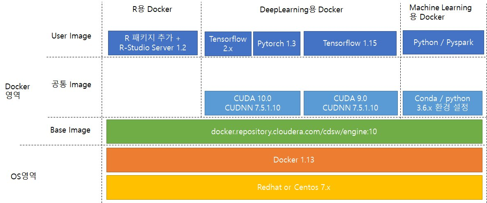

# JB금융지주용 CDSW 도커 이미지 만들기

## 도커 이미지 구조

## R용 도커 이미지 

- R-Studio 기능 추가  
  - [01.rstudio.Dockerfile](https://github.com/braveji18/hadoop/blob/master/02_cdsw/04_jbfg/cdsw1.7/R/01.rstudio.Dockerfile) 

- R패키지 추가( 290개 정도 ) 
  - [02.R_LIB.Dockerfile](https://github.com/braveji18/hadoop/blob/master/02_cdsw/04_jbfg/cdsw1.7/R/02.R_LIB.Dockerfile)

- 빌드 방법
  - sh  01_make.sh  jbfg.com  :  01.rstudio.Dockerfile 빌드 
  - sh  02_make.sh  jbfg.com  :  02.R_LIB.Dockerfile 빌드
  - sh  save_docker.sh  jbfg.com : 생성된 도커이미지를 파일로 추출 
  - sh  all_jbfg.sh : 위의 3가지 단계를 한번에 처리
  
- 생성된 최종 이미지명 
  - rstudio.jbfg.com/cdsw/engine:10
  
## Python/Deeplearning용 도커 이미지 

- CUDA 설정
  - [01.01.cuda9.Dockerfile](https://github.com/braveji18/hadoop/blob/master/02_cdsw/04_jbfg/cdsw1.7/Python/01.01.cuda9.Dockerfile)
  - [01.02.cuda10.Dockerfile](https://github.com/braveji18/hadoop/blob/master/02_cdsw/04_jbfg/cdsw1.7/Python/01.02.cuda10.Dockerfile)

- conda/파이션 패치지 설정 
  - [02.01.conda.Dockerfile](https://github.com/braveji18/hadoop/blob/master/02_cdsw/04_jbfg/cdsw1.7/Python/02.01.conda.Dockerfile)

- Deeplearning용 패키지 설정
  - [03.01.tensorflow2.0.Dockerfile](https://github.com/braveji18/hadoop/blob/master/02_cdsw/04_jbfg/cdsw1.7/Python/03.01.tensorflow2.0.Dockerfile)
  - [03.02.pytorch1.3.Dockerfile](https://github.com/braveji18/hadoop/blob/master/02_cdsw/04_jbfg/cdsw1.7/Python/03.02.pytorch1.3.Dockerfile)
  - [03.03.tensorflow1.15.Dockerfile](https://github.com/braveji18/hadoop/blob/master/02_cdsw/04_jbfg/cdsw1.7/Python/03.03.tensorflow1.15.Dockerfile)

- 빌드 방법 
  - sh 01_make.sh jbfg.com :  
  - sh 02_make.sh jbfg.com : 
  - sh 03_01_make.sh jbfg.com : Tensorflow 2.x  빌드 
  - sh 03_02_make.sh jbfg.com : pytorch 1.3  빌드   
  - sh 03_03_make.sh jbfg.com : Tensorflow 1.15  빌드  
  - sh save_docker.sh jbfg.com :  파일로 추출
  - sh [check_pkg.sh](https://github.com/braveji18/hadoop/blob/master/02_cdsw/04_jbfg/cdsw1.7/Python/check_pkg.sh) jbfg.com  : 설치한 패키지를 import 가 되는지 확인   
  - sh  all_jbfg.sh : 위의 단계를 한번에 처리
  
  
  
